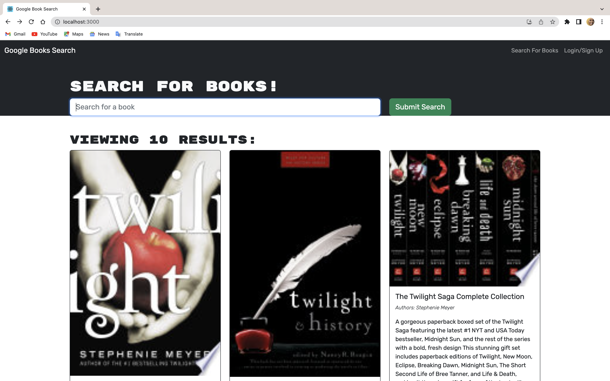

# Book Search Engine Starter Code

Unearth new literary treasures with our Book Search Engine. Whether you're in need of a new novel to dive into or researching material for a project, our search engine will assist in finding the perfect book to match your search terms. The API generates the top ten results for any book or keyword you type in, offering a wealth of book recommendations at your fingertips.

## Usage
Embark on your unique reading journey with our platform. To get started, simply login or sign up using the provided link. Once you've accessed your account, you can search for books by entering keywords or titles into the search bar. Discover a book that piques your interest? Click the 'save' button to add it to your personal collection found in the 'Saved Books' section. See the magic happen on our App homepage. 

## Setup
Setting up the application locally involves a few steps:

Clone the repository to your local machine.
Install all necessary packages by running npm install.
Start the server using npm start command.
Visit http://localhost:3000 in your browser.
Technologies Used
The Book Search Engine is built using the MERN stack:

MongoDB
Express.js
React.js
Node.js
Credits
We extend our gratitude to the University of Minnesota for the boilerplate code that served as a starting point for this project.

## Contributing
Please feel free to fork the project, make your changes, and open a pull request.

## Questions?
If you have any questions or encounter any issues, don't hesitate to reach out to via email at muntaas.hassan@gmail.com

## License
This project is licensed under the terms of the MIT license.

